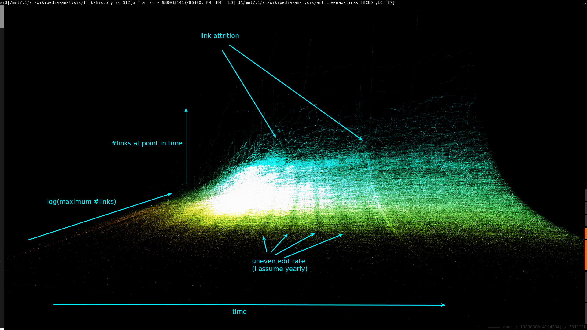

# Page/page links over time
I want to see if it's possible to visualize this somehow. The first step is to
start with the history and build a series of link-list snapshots. We should get
a format like `page contributor timestamp link1 link2 ...`.

If we want a series of revisions from the article, we can sequentially parse
pairs of `<timestamp>` and `<text>` nodes, tracking state in a series of
variables. I just added [the SX
operator](https://github.com/spencertipping/ni/commit/f573d9bb6d33d9a190c5a5d93677086a4e1bb678)
to simplify this a bit.

```sh
$ ni /mnt/v1/data/wikipedia-history-2018.0923 \
     SX24 [\$'"7z://{}"' \<] \
          z\>\$'"link-history/" . basename("{}") =~ s/\.7z$//r' \
          p'^{$title = $contributor = $time = undef}
            $title       = $1, return () if /<title>([^<]+)/;
            $contributor = $1, return () if /<(?:ip|username)>([^<]+)/;
            $time        = $1, return () if /<timestamp>([^<]+)/;
            r $title, $contributor, tpe($time =~ /\d+/g),
              map /\[\[([^]\|]+)/g, ru {/<\/text>/} if /<text/; ()'
```

## Let's visualize this
I'm not completely sure where to start, so let's kick this off by taking a look
at articles ordered by the maximum number of outbound links in their history.
Maybe we'll find something interesting in the trends.

```sh
$ ni link-history \<S24[p'r a, FM' p'r a, max b_ rea'] gp'r a, max b_ rea' \
     z\>article-max-links
```

```
sr3[/mnt/v1/st/wikipedia-analysis/link-history \< S12[p'r a, (c - 980043141)/86400, FM, FM' ,LD] JA/mnt/v1/st/wikipedia-analysis/article-max-links fBCED ,LC rE7]
http://localhost:8090/#%7B%22ni%22:%22sr3%5B/mnt/v1/st/wikipedia-analysis/link-history%20%5C%5C%3C%20S12%5Bp'r%20a,%20(c%20-%20980043141)/86400,%20FM,%20FM'%20,LD%5D%20JA/mnt/v1/st/wikipedia-analysis/article-max-links%20fBCED%20,LC%20rE7%5D%22,%22v%22:%7B%22br%22:4,%22ot%22:%5B-3063.997192321744,-725.0510961111028,-6.148829055389751%5D,%22os%22:%5B2.637944459354155,3.1267683651861446,1107.6545049007123%5D,%22sa%22:0.01679695099696201,%22cr%22:%5B2.99999999999995,5.66666666666669%5D,%22cd%22:7594.428656918745,%22axes%22:%5B0,1,2,3%5D%7D%7D
```


